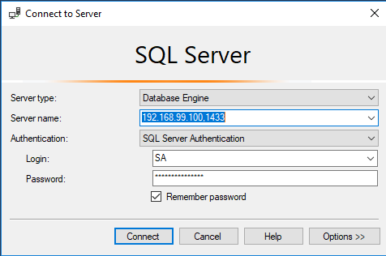

# Tietokannat 2 - Oppimistehtävä 3 - Tutustuminen toiseen RDBMS:ään

Jarmo Syvälahti

2019

Tehtävän tarkoituksena on tutustua joko SQL Serveriin tai Oracleen. Pistä käyttökuntoon valitsemaasi DBMS ja testaile sitä. Dokumentoi oppimistehtäväraporttiin asennuksen vaiheet ja mahdolliset ongelmat. Tutustu järjestelmään ja sen tarjoamiin välineisiin. Luo järjestelmään esimerkiksi Kertausta-kansiosta löytyvä kirjasto-tietokanta tai relaatiotietokantatehtäviin kuuluva tilastokanta. Joudut mahdollisesti tekemään pieniä muutoksia koodeihin muuntaaksesi sen toiselle DBMS:lle sopivaksi. Lisää kantaasi pari edistynyttä piirrettä (esimerkiksi herätin, transaktio ja proseduuri). Liitä mukaan valitsemallesi DBMS:lle sovittamasi koodit ja pari kuvankaappausta järjestelmästä. Kirjaa nämä muutokset myös oppimistehtäväraporttiin.

Kuvaile lyhyesti myös seuraavia asioita:

**Kuinka kauan oppimistehtävän tekemiseen meni aikaa?**

8 tuntia

**Mitkä olivat pahimmat ongelmat vai oliko niitä lainkaan?**

Käynnistäyessä konttia se sammui aina heti. Tarkistin docker logsilla lokin ja huomasin, että muistia on liian vähän virtuaalikoneessa verrattuna minimivaatimuksiin, asetin sen 1024MB -> 2048MB niin alkoi toimimaan.

Triggerin määrittelyssä oli jonkin verran eroavaisuuksia, ja FOR EACH ROWin sijaan piti iteroida useamman rivin inserttiä kursorilla.

**Kuinka helppoa tai vaikeata sinun on tutustua uusiin DBMS-järjestelmiin nykyisen osaamisesi ja tietämyksesi pohjalta?**

Vaatii jonkin verran googlailua, miten tietyt asiat tehdään, mutta kun tuntee yhden systeemin kohtalaisesti ja dbms-järjestelmiin liittyviä käsitteitä, niin on helppo hakea eroavaisuuksia oikeilla hakusanoilla.

## Asentaminen

Valitsin tehtävää varten Microsoft SQL Serverin.

Express-version asentaminen dockeriin:

```
docker run -e 'ACCEPT_EULA=Y' -e 'SA_PASSWORD=Salasana1' -e 'MSSQL_PID=Express' --name tk2-mssql-server -p 1433:1433 -d mcr.microsoft.com/mssql/server:2017-latest-ubuntu
```

Asensin [SQL Server Management Studio (SSMS)](https://docs.microsoft.com/en-us/sql/ssms/download-sql-server-management-studio-ssms?view=sql-server-2017) edustaohjelman.



## Tietokannan luominen

SSMS: Databases -> New database

Muutokset kirjastokannan luontilauseisiin:
- tarkitus onko tietokanta samalla nimellä olemassa vähän monimutkaisempi
- AUTO_INCREMENT -> IDENTITY(1,1)
- constraint RESTRICT -> NO ACTION 
- poista ENGINE=INNODB
- lisää Lainaus ja Nide inserttejä ennen SET IDENTITY_INSERT 'table' ON


```sql
IF NOT EXISTS 
  (
  SELECT name FROM master.dbo.sysdatabases 
  WHERE name = N'kirjasto'
  )
BEGIN
  CREATE DATABASE kirjasto;
END  

USE kirjasto;

/* Poista olemassa olevat taulut */
DROP TABLE IF EXISTS LainausNide;
DROP TABLE IF EXISTS Lainaus;
DROP TABLE IF EXISTS Nide;
DROP TABLE IF EXISTS Nimeke;
DROP TABLE IF EXISTS Puhelin;
DROP TABLE IF EXISTS Asiakas;

/* Luo taulut */
CREATE TABLE Asiakas (
asiakas             CHAR(11) NOT NULL,
etunimi             VARCHAR(20) NOT NULL,
sukunimi            VARCHAR(40) NOT NULL,
lahiosoite          VARCHAR(50) NOT NULL,
postinumero         CHAR(5) NOT NULL,
postitoimipaikka    VARCHAR(20) NOT NULL,
sakot_yhteensa      DECIMAL(10,2) DEFAULT 0,
PRIMARY KEY (asiakas)
);

CREATE TABLE Puhelin (
puhelin             INT IDENTITY(1,1) NOT NULL,
puhnro              VARCHAR(20) NOT NULL,
asiakas             CHAR(11) NOT NULL,
PRIMARY KEY (puhelin),
CONSTRAINT puhelin_asiakas_fk
   FOREIGN KEY (asiakas) REFERENCES Asiakas(asiakas)
      ON UPDATE CASCADE
      ON DELETE CASCADE
); 

CREATE TABLE Nimeke (
nimeke              VARCHAR(20) NOT NULL,
nimi                VARCHAR(50) NOT NULL,
etunimi             VARCHAR(20),
sukunimi            VARCHAR(50),
kustantaja          VARCHAR(50),
luokitus            VARCHAR(10),
PRIMARY KEY (nimeke)
); 

CREATE TABLE Nide (
nide                INT IDENTITY(1,1) NOT NULL,
korjauspaiva        DATE,
sijainti            VARCHAR(10),
nimeke              VARCHAR(20) NOT NULL,
PRIMARY KEY (nide),
CONSTRAINT nide_nimeke_fk
   FOREIGN KEY (nimeke) REFERENCES Nimeke(nimeke)
      ON UPDATE CASCADE
      ON DELETE NO ACTION
); 

CREATE TABLE Lainaus (
lainaus             INT IDENTITY(1,1) NOT NULL,
lainauspaiva        DATE NOT NULL,
erapaiva            DATE NOT NULL,
asiakas             CHAR(11) NOT NULL,
PRIMARY KEY (lainaus),
CONSTRAINT lainaus_asiakas_fk
   FOREIGN KEY (asiakas) REFERENCES Asiakas(asiakas)
      ON UPDATE CASCADE
      ON DELETE CASCADE
); 

CREATE TABLE LainausNide (
lainaus             INT NOT NULL,
nide                INT NOT NULL,
PRIMARY KEY (lainaus, nide),
CONSTRAINT lainausnide_lainaus_fk
   FOREIGN KEY (lainaus) REFERENCES Lainaus(lainaus)
      ON UPDATE CASCADE
      ON DELETE CASCADE,
CONSTRAINT lainausnide_nide_fk
   FOREIGN KEY (nide) REFERENCES Nide(nide)
      ON UPDATE CASCADE
      ON DELETE CASCADE
); 

/* Luo testimateriaali - testimateriaali on täysin keksittyä */
INSERT INTO Asiakas(asiakas, etunimi, sukunimi, lahiosoite, postinumero, postitoimipaikka) VALUES
('010180-111A', 'Pekka', 'Pekkanen', 'Kotikatu 1', '40100', 'Jyväskylä'),
('311285-999Z', 'Anneli', 'Auvinen', 'Koulukatu 2', '40100', 'Jyväskylä'),
('111070-222B', 'Mauno', 'Manninen', 'Kauppakatu 1 A 1', '40100', 'Jyväskylä'),
('150575-333C', 'Riitta', 'Ruuskanen-Rantanen', 'Kirkkotie 5', '40500', 'Jyväskylä'),
('060695-444D', 'Keijo', 'Karhunen', 'Keskustie 1', '40950', 'Muurame'),
('070790-555E', 'Sinikka', 'Sinkkonen', 'Kotikatu 1', '40100', 'Jyväskylä');

INSERT INTO Puhelin(puhnro, asiakas) VALUES
('040-1111222', '010180-111A'),
('050-1111222', '010180-111A'),
('041-6667777', '150575-333C'),
('040-9998888', '070790-555E'),
('050-5656567', '311285-999Z'),
('040-7777777', '111070-222B'),
('041-8888888', '111070-222B');

INSERT INTO Nimeke(nimeke, nimi, etunimi, sukunimi, kustantaja, luokitus) VALUES
('1111-2222-333', 'SQL-Opas', 'Ari', 'Hovi', 'Nörttikustannus oy', '11.1'),
('2222-3333-444', 'Esirippu', 'Agatha', 'Christie', 'Kustannusosakeyhtiö Jännärit', '84.2'),
('3333-4444-555', 'Kuolema Niilillä', 'Agatha', 'Christie', 'Kustannusosakeyhtiö Jännärit', '84.2'),
('4444-5555-666', 'Python-ohjelmointi', 'Pertti', 'Python', 'Nörttikustannus oy', '11.1'),
('5555-6666-777', 'Suomen linnut', 'Lauri', 'Laihonen', 'Oy Luontokirjat Ab', '55.5'),
('6666-7777-888', 'TV:n historia', 'Tellervo', 'Tarvainen', 'Omakustanne', '66.6');

SET IDENTITY_INSERT Nide ON

INSERT INTO Nide(nide, korjauspaiva, sijainti, nimeke) VALUES
(1, NULL, 'Hyllyssä', '4444-5555-666'),
(2, NULL, 'Hyllyssä', '4444-5555-666'),
(1000, '2010-12-12', 'Hyllyssä', '6666-7777-888'),
(1001, NULL, 'Lainassa', '5555-6666-777'),
(112345, '2010-05-04', 'Lainassa', '1111-2222-333'),
(112346, '2010-05-04', 'Hyllyssä', '1111-2222-333'),
(199999, NULL, 'Hyllyssä', '2222-3333-444'),
(200000, NULL, 'Hyllyssä', '3333-4444-555'),
(200001, NULL, 'Lainassa', '3333-4444-555'),
(200002, NULL, 'Hyllyssä', '3333-4444-555'),
(200003, NULL, 'Hyllyssä', '3333-4444-555'),
(200004, NULL, 'Hyllyssä', '3333-4444-555'),
(200005, NULL, 'Hyllyssä', '3333-4444-555');

SET IDENTITY_INSERT Nide OFF

SET IDENTITY_INSERT Lainaus ON

INSERT INTO Lainaus(lainaus, lainauspaiva, erapaiva, asiakas) VALUES
(1, '2011-01-12', '2011-02-12', '010180-111A'),
(2, '2011-01-12', '2011-02-12', '311285-999Z'),
(3, '2011-02-01', '2011-03-01', '111070-222B'),
(4, '2011-03-01', '2011-04-01', '010180-111A');

SET IDENTITY_INSERT Lainaus OFF

INSERT INTO LainausNide(lainaus, nide) VALUES
(1, 112345),
(1, 1000),
(1, 200005),
(1, 1001),
(2, 199999),
(3, 112345),
(3, 200001),
(4, 199999);
```

## Edistyneempiä ominaisuuksia

### Herätin

Trigger joka luo uutuudet-tauluun uutisen kun uusi nimeke lisätään.

Esim. 'Esirippu, kirjoittanut Agatha Christie ja julkaissut Kustannusosakeyhtiö Jännärit, lisätty 28.03.2019'

```sql
-- luodaan taulu uutisia varten
CREATE TABLE Uutuudet (
uutuudet             INT IDENTITY(1,1) NOT NULL,
kuvaus                VARCHAR(200),
PRIMARY KEY (uutuudet)
);
GO

-- poistetaan triggeri jos se on jo olemassa
DROP TRIGGER IF EXISTS lisaa_nimeke_trg;
GO

-- luodaan triggeri
CREATE TRIGGER lisaa_nimeke_trg 
ON Nimeke 
AFTER INSERT 
AS
DECLARE lisaa_nimeke_trg_cursor CURSOR FOR
SELECT nimi, etunimi, sukunimi, kustantaja FROM inserted
DECLARE @nimi VARCHAR(50), @etunimi VARCHAR(50), @sukunimi VARCHAR(50), @kustantaja VARCHAR(50);
OPEN lisaa_nimeke_trg_cursor;
FETCH NEXT FROM lisaa_nimeke_trg_cursor INTO @nimi, @etunimi, @sukunimi, @kustantaja
WHILE @@FETCH_STATUS = 0
BEGIN
    DECLARE @kuvausteksti VARCHAR(200);

    SELECT @kuvausteksti = CONCAT(@nimi, ', ', 'kirjoittanut ', 
    @etunimi, ' ', @sukunimi, ' ja kustantanut ', @kustantaja, 
    ', lisätty ', convert(varchar, getdate(), 104));
    
    INSERT INTO Uutuudet(kuvaus) VALUES (@kuvausteksti);

  FETCH NEXT FROM lisaa_nimeke_trg_cursor INTO @nimi, @etunimi, @sukunimi, @kustantaja
END;
CLOSE lisaa_nimeke_trg_cursor;
DEALLOCATE lisaa_nimeke_trg_cursor;
GO

-- lisätään testiaineistoa
INSERT INTO Nimeke(nimeke, nimi, etunimi, sukunimi, kustantaja, luokitus) VALUES
('1234-5678-999', 'Voehan JavaScript', 'Kaaro', 'Niemi', 'Nörttikustannus oy', '11.1'),
('9876-5432-111', 'Eikä yksikään pelastunut', 'Agatha', 'Christie', 'Kustannusosakeyhtiö Jännärit', '84.2');
GO

-- poistetaan testiaineisto
DELETE FROM Nimeke WHERE nimeke IN ('1234-5678-999', '9876-5432-111'); 
GO

-- poistetaan uutuudet taulu
DROP TABLE Uutuudet;
GO
```

### Proseduuri ja transaktio

Proseduuri, joka poistaa nimikkeen ja siihen liittyvät niteet valikoimista, sekä palauttaa poistettavan nimikkeen nimen ja poistettavien niteiden määrän.

```sql
-- poistetaan proseduuri jos se on jo olemassa
IF OBJECT_ID ( 'poista_nimeke_nide', 'P' ) IS NOT NULL
   DROP PROCEDURE poista_nimeke_nide;
GO

-- luodaan proseduuri
CREATE PROCEDURE poista_nimeke_nide @nimeke varchar(20), @nimeke_nimi varchar(50) OUT, @nide_maara int OUT
AS
  -- haetaan poistettavien niteiden määrä out parametriin
  SET @nide_maara = (SELECT COUNT(*) FROM Nide n
  INNER JOIN Nimeke nm ON nm.nimeke = n.nimeke
  WHERE nm.nimeke = @nimeke);

   -- haetaan poistettavaan nimekeen nimi out parametriin
  SET @nimeke_nimi = (SELECT nimi FROM Nimeke 
  WHERE nimeke = @nimeke);

  BEGIN TRY
  -- aloitetaan transaktio
    BEGIN TRANSACTION poista_nimike_nide_trans

      -- määritetään kursori poistettaville niteille
      DECLARE poista_niteet_cursor CURSOR FOR
      SELECT n.nide FROM Nide n
      INNER JOIN Nimeke nm ON nm.nimeke = n.nimeke
      WHERE nm.nimeke = @nimeke;

      DECLARE @nide int;
      OPEN poista_niteet_cursor;

      -- iteroidaan kursoria ja poistetaan sen palauttamat niteet
      FETCH NEXT FROM poista_niteet_cursor INTO @nide
      WHILE @@FETCH_STATUS = 0
      BEGIN
        DELETE FROM Nide 
        WHERE nide = @nide;

        FETCH NEXT FROM poista_niteet_cursor INTO @nide
      END;

      CLOSE poista_niteet_cursor;
      DEALLOCATE poista_niteet_cursor;

      -- poistetaan lopuksi nimeke
      DELETE FROM Nimeke 
      WHERE nimeke = @nimeke;
    COMMIT TRANSACTION poista_nimike_nide_trans
  END TRY

   -- jos tulee poikkeus, perutaan transaktio
  BEGIN CATCH
    ROLLBACK TRANSACTION poista_nimike_nide_trans
  END CATCH
GO

-- testataan proseduuria
DECLARE @nimeke_nimi varchar(50), @nide_maara int;
EXECUTE poista_nimeke_nide '3333-4444-555', @nimeke_nimi OUT, @nide_maara OUT;
SELECT @nimeke_nimi AS poistettava_nimeke, @nide_maara AS poistettujen_niteiden_määrä;
GO
```
